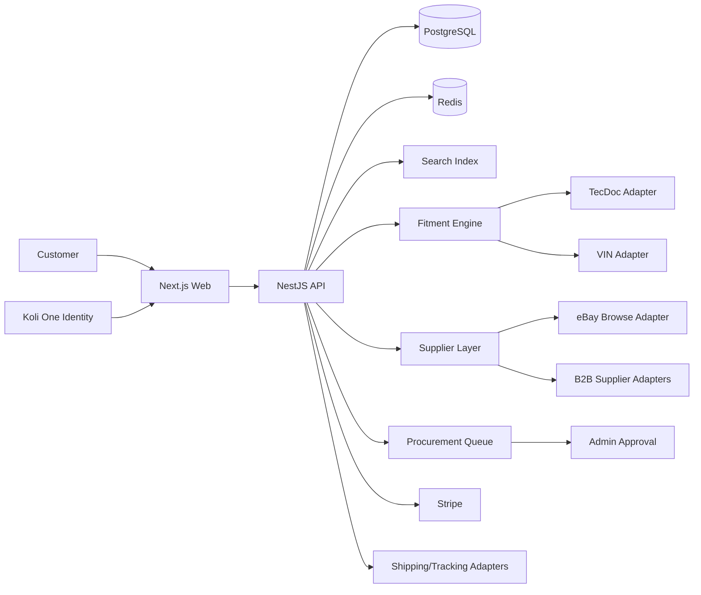

# Koli Parts — PROJECT_SPEC 2.0

Status: **PROPOSED GOVERNING SPEC**  
Root: `C:\Users\hamda\Desktop\Koli_Parts_Root`  
Launch market: Bulgaria  
Primary currency: EUR  
Languages: Bulgarian + English  
Initial discovery marketplace: eBay Germany (`EBAY_DE`)  
Identity ecosystem: Koli One (`koli.one`) + Koli Parts (`koli-one.com`)

## 1. Product mission

Koli Parts is a production-grade automotive parts commerce platform focused on answering one question better than ordinary parts stores: **“Is this part actually right for my vehicle?”** It combines vehicle identity, VIN/OEM/TecDoc evidence, normalized supplier inventory, trustworthy pricing, and operational procurement into one Bulgarian-first experience.

Koli Parts is not an “eBay wrapper”. eBay is one possible supply/discovery channel behind a supplier abstraction. The platform must remain viable if eBay checkout access is unavailable or economically unsuitable.

## 2. Constitutional product rules

1. Koli One and Koli Parts form one ecosystem. Users should not create a second unrelated identity.
2. Password hashes are never copied between products. SSO/token verification is used.
3. Koli One source code is the source of truth for brand/design identity.
4. Parts fitment is evidence-driven. LLM output can explain evidence but cannot override authoritative structured conflicts.
5. Procurement begins semi-automated with human approval.
6. Automated procurement is feature-gated and disabled by default until external/API/legal gates pass.
7. Every monetary create/update path is idempotent and auditable.
8. Supplier capability is explicit (`liveInventory`, `automatedOrdering`, `trackingApi`, `returnsApi`, etc.).
9. Canonical products are separated from supplier listings.
10. Search indexes are derived data and rebuildable.

## 3. Existing technical baseline

The current root is already a Turbo/npm workspace. The lockfile indicates:
- `apps/api`: NestJS 11 + TypeScript.
- `apps/web`: Next.js 16.2.12 + React 19.2.4 + TypeScript.
- Node >=20.

Therefore the default architecture is a **modular monolith** in NestJS with a Next.js frontend, Postgres as source of truth, Redis for cache/locks/jobs, and a dedicated search engine only when justified by measured needs.

## 4. Scope

### MVP scope
- Koli One SSO/account provisioning.
- Vehicle Garage.
- VIN decode provider abstraction.
- OEM/part number search.
- eBay Browse discovery for `EBAY_DE`.
- Canonical product + supplier listing normalization.
- Fitment evidence and confidence tiers.
- Search/filter/autocomplete.
- Cart, quote snapshots, price validation.
- Stripe authorization/capture strategy.
- Semi-manual procurement queue.
- Tracking abstraction.
- Returns foundation.
- Admin operations and audit logs.
- Bulgarian/English localization.
- Koli One visual parity.

### Explicitly out of MVP until gates pass
- Fully automatic eBay buying.
- Browser automation that circumvents eBay API/business restrictions.
- Uncalibrated claims such as “97% probability” for fitment.
- Multi-country launch.
- Microservice decomposition without measured need.
- Kubernetes by default.

## 5. GATE-0 — eBay procurement feasibility

Current verdict: **YES WITH CONDITIONS / DIRECT EBAY_DE→BULGARIA BUY-CHECKOUT PATH BLOCKED BY CURRENT BUY API UX REQUIREMENT**.

Facts:
- Browse can support discovery on `EBAY_DE`.
- Buy Order API checkout is Limited Release and requires production approval/contracts.
- Current Buy API requirements require delivery country to be domestic to the marketplace for checkout items. `EBAY_DE` therefore implies German delivery.

Implication: Koli Parts must not implement `POST /fulfillments/execute` as “buy from eBay to Bulgarian customer” unless eBay explicitly approves a compliant flow. Supported strategic paths are:
1. Browse/discovery + affiliate/referral.
2. Approved eBay checkout to a German forwarding/procurement hub, then separate DE→BG fulfillment, after contract/legal/economic validation.
3. Direct B2B agreements with German parts suppliers/sellers.
4. Human/admin procurement using permitted operational processes, without representing this as an API capability and without browser automation circumvention.

## 6. Target architecture

## 7. Domain modules

- Auth / Identity
- Users
- Vehicles / VIN
- Catalog
- Suppliers
- eBay
- Fitment
- Search
- Cart
- Pricing / Quotes
- Orders
- Payments
- Procurement
- Shipping / Tracking
- Returns / Refunds
- Notifications
- Admin
- Audit / Security
- Analytics

## 8. Canonical data principles

- `products` represent normalized parts.
- `supplier_listings` represent market offers.
- `listing_snapshots` preserve quote-time supplier facts.
- `fitment_evidence` stores why a part is considered compatible.
- `compatibility_evaluations` stores rule score/tier and inputs.
- `quotes` freeze customer-facing price components for a short window.
- `procurements` represent attempts to acquire ordered items from a supplier.
- `order_events` and `audit_logs` make state transitions inspectable.

## 9. Fitment hierarchy

1. Exact authoritative OEM/TecDoc vehicle relation.
2. Exact OEM cross-reference + vehicle/engine relation.
3. Supplier structured compatibility.
4. Listing metadata/title evidence.
5. AI inference/extraction.

Tier 5 cannot override a Tier 1 contradiction.

Customer status vocabulary:
- `CONFIRMED_FIT`
- `HIGH_CONFIDENCE`
- `VERIFY_OEM`
- `UNKNOWN`
- `NOT_COMPATIBLE`

## 10. Search behavior

Input modes:
- free text BG/EN/DE terms,
- OEM/MPN/GTIN,
- VIN/selected vehicle,
- make/model/year/engine,
- future DTC-assisted suggestions.

MVP recommendation: keep Postgres authoritative; use Meilisearch for typo-tolerant faceting if the current code has no stronger existing search dependency. Abstract the search provider so Algolia/OpenSearch can replace it later.

## 11. Checkout safety

Before payment authorization:
1. validate cart,
2. re-fetch/refresh supplier listing,
3. verify shipping eligibility for the chosen procurement route,
4. re-run critical fitment checks,
5. recalculate price,
6. validate minimum contribution margin,
7. create expiring quote snapshot,
8. authorize payment.

After authorization:
- create internal order,
- acquire internal reservation/lock to prevent duplicate local processing,
- enqueue procurement review,
- admin approves/rejects,
- supplier order is performed only through a permitted capability,
- capture/settle according to the payment decision matrix,
- tracking is attached when available.

An internal reservation is **not an eBay inventory reservation** and must never be described as such.

## 12. Procurement state machine

`DRAFT → PAYMENT_PENDING → PAYMENT_AUTHORIZED → PROCUREMENT_PENDING → PROCUREMENT_REVIEW → PROCUREMENT_APPROVED → PROCUREMENT_STARTED → PROCUREMENT_CONFIRMED → FULFILLMENT_PENDING → SHIPPED → DELIVERED`

Failure/exception states include `SUPPLIER_OUT_OF_STOCK`, `SUPPLIER_PRICE_CHANGED`, `SUPPLIER_REJECTED`, `MANUAL_REVIEW`, `CANCELLED`, `RETURN_REQUESTED`, `REFUND_PENDING`, `REFUNDED`, `FAILED`.

All transitions are validated and evented.

## 13. Seller reliability

Do not hard-code arbitrary production thresholds before baseline data. MVP can use conservative policy defaults tagged `PROVISIONAL`, e.g. high feedback percentage and meaningful transaction count, while collecting internal metrics for cancellations, stock mismatch, delivery, damage, invoice/branding issues and wrong-item disputes.

## 14. Visual identity

Koli Parts reuses Koli One's first-party visual language.

Verified current Koli One sources establish:
- body: Inter,
- headings: Exo 2,
- light primary: `#0F766E`,
- dark primary: `#1DE6CB`,
- light background: `#F7FBFA`,
- dark background: `#0B0F12`,
- brand LED: `#1DE6CB`,
- tertiary premium indigo: light `#1A237E`, dark `#A5B4FC`.

New components use semantic tokens, not hard-coded page-specific colors.

## 15. Security baseline

- Admin MFA.
- RBAC least privilege.
- encrypted sensitive provider tokens at rest.
- managed secret store in production.
- webhook signature/verification checks.
- idempotency for money/order/procurement/refund operations.
- rate limiting.
- structured audit logs.
- dependency/SAST scanning in CI.
- no secrets in client bundles or logs.
- emergency kill switches.

## 16. Compliance gates

Before production, obtain Bulgarian legal/accounting confirmation for:
- merchant-of-record model,
- VAT/OSS treatment and invoicing,
- returns/withdrawal disclosure,
- warranty/conformity responsibilities,
- used parts terms,
- product safety/GPSR role,
- supplier invoice/branding treatment,
- German hub/forwarding model if selected,
- restricted/hazardous automotive categories.

## 17. KPI baseline

Track:
- search → product CTR,
- vehicle-selected search share,
- add-to-cart,
- checkout conversion,
- procurement success rate,
- supplier price/stock mismatch,
- wrong-fit return rate,
- overall return rate,
- median procurement time,
- median delivery time,
- contribution margin/order,
- refund cycle time,
- repeat purchase rate.

Historical target values from `START_MEIN_PLAN_1.0.md` are baselines to validate, not unquestioned promises.

## 18. Release gates

No production automation without:
- eBay/provider permission confirmed,
- legal/accounting model signed off,
- payment idempotency and reconciliation tests,
- fitment accuracy measured,
- return/refund E2E tests,
- secrets and MFA in production,
- kill switch tested,
- monitoring/alerting active,
- disaster recovery tested.

See `docs/GO_NO_GO.md`.
