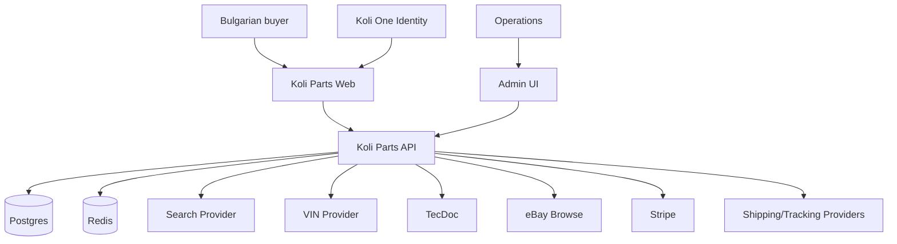

# Architecture

## Decision

Use a **modular monolith** first: Next.js web + NestJS API + Postgres + Redis. Add a worker process when background throughput warrants it. Keep external services behind adapters.

## Context

## Bounded modules

Auth, Users, Vehicles, Catalog, Suppliers, eBay, Fitment, Search, Pricing, Cart, Orders, Payments, Procurement, Shipping, Returns, Admin, Audit, Analytics.

## Rules

- No module reads another module's tables ad hoc; use module services/repositories.
- External provider DTOs are normalized at the adapter boundary.
- Payment/order/procurement state transitions are explicit.
- Search is eventually consistent and rebuildable from Postgres.
- Redis locks coordinate local workflow only; they do not reserve supplier stock.
- Feature flags control risky external/financial behavior.

## Deployment stages

### Local
Docker Compose: Postgres, Redis, Meilisearch; API/web run either on host or containers.

### Staging
Managed Postgres + managed Redis + container services; provider sandbox/test credentials.

### Production
Managed DB with PITR, managed Redis, container runtime, managed secrets, CDN/WAF where appropriate, Sentry/OpenTelemetry.

Kubernetes is not a requirement for MVP.
