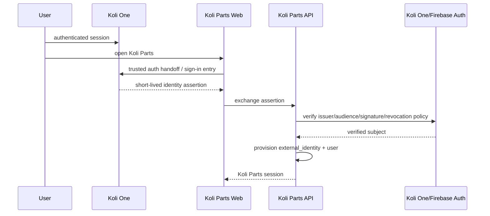

# Koli One ↔ Koli Parts SSO

## Goal

A Koli One user opening Koli Parts should be recognized without creating a second password identity.

Domains:
- Koli One: `koli.one`
- Koli Parts: `koli-one.com`

Because these are separate registrable domains, do not rely on a shared cookie.

## Recommended first design

If Koli One still uses Firebase Authentication as the source of truth, Koli Parts should accept a short-lived Koli One/Firebase identity token and verify it server-side, then provision/map an internal user record.

Flow:

## Security requirements

- exact redirect allow-list,
- state + nonce where applicable,
- PKCE for OAuth-style browser flow,
- one-time/short-lived assertions,
- issuer and audience verification,
- session rotation after login,
- CSRF protection,
- secure/httpOnly/sameSite cookies,
- logout/revocation behavior documented,
- account deletion propagation,
- role mapping is deny-by-default.

## Data model

`users` owns Koli Parts commerce profile. `external_identities` maps provider + provider subject to internal user. Never duplicate passwords.

## Open decision

Before coding, inspect Koli One's current auth implementation and decide whether shared Firebase project, token verification, or a central broker is the long-term contract. Record the decision in ADR-002.
