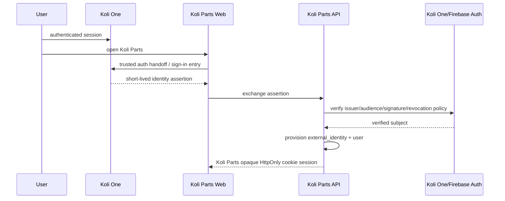

# Koli One ↔ Koli Parts SSO

## Goal

A Koli One user opening Koli Parts should be recognized without creating a second password identity.

Domains:
- Koli One: `koli.one`
- Koli Parts: `koli-one.com`

Because these are separate registrable domains, do not rely on a shared cookie.

## Audited first design

Koli One currently uses Firebase Authentication as the source of truth. Evidence:

- `C:\Users\hamda\Desktop\Koli_One_Root\.firebaserc:3` sets the Firebase project to `fire-new-globul`.
- `C:\Users\hamda\Desktop\Koli_One_Root\src\firebase\firebase-config.ts:66-79` configures the Firebase web app from environment values.
- `C:\Users\hamda\Desktop\Koli_One_Root\src\contexts\AuthProvider.tsx:71-89` subscribes to Firebase auth state.
- `C:\Users\hamda\Desktop\Koli_One_Root\src\contexts\AuthProvider.tsx:398-408` logs out with Firebase `signOut(auth)`.
- `C:\Users\hamda\Desktop\Koli_One_Root\functions\src\api\marketplace-api.ts:56-68` verifies `Authorization: Bearer` Firebase ID tokens with the Firebase Admin SDK.
- `C:\Users\hamda\Desktop\Koli_One_Root\functions\src\config\allowed-origins.ts:12-25` defines the current Koli One CORS allow-list.

No Koli One server session-cookie broker was found. The initial Koli Parts contract is therefore:

- accept a Firebase ID token from Koli One project `fire-new-globul`;
- verify issuer `https://securetoken.google.com/fire-new-globul`;
- verify audience `fire-new-globul`;
- run Firebase Admin SDK revocation checks where credentials are available;
- provision/map `external_identities(provider='firebase', provider_subject=uid)`;
- issue a Koli Parts opaque session token in a Secure/HttpOnly/SameSite cookie;
- initialize users with no privileged role.

Flow:

## Security requirements

- exact redirect allow-list,
- state + nonce where applicable,
- PKCE for OAuth-style browser flow,
- one-time/short-lived assertions,
- issuer and audience verification,
- session rotation after login,
- CSRF protection,
- secure/httpOnly/sameSite cookies,
- logout/revocation behavior documented,
- account deletion propagation,
- role mapping is deny-by-default.

## Data model

`users` owns Koli Parts commerce profile. `external_identities` maps provider + provider subject to internal user. `auth_sessions` stores only hashed opaque session tokens. `roles` and `user_roles` are default-deny; upstream Firebase custom claims are not mapped to Koli Parts privileges until a role mapping policy is explicitly approved and tested. Never duplicate passwords.

## Remaining decisions

- Browser handoff route from Koli One to Koli Parts web.
- CSRF token mechanism for state-changing browser requests.
- Admin MFA assurance storage and role-management UI.
- Account deletion propagation from Koli One to Koli Parts soft-deleted users.
