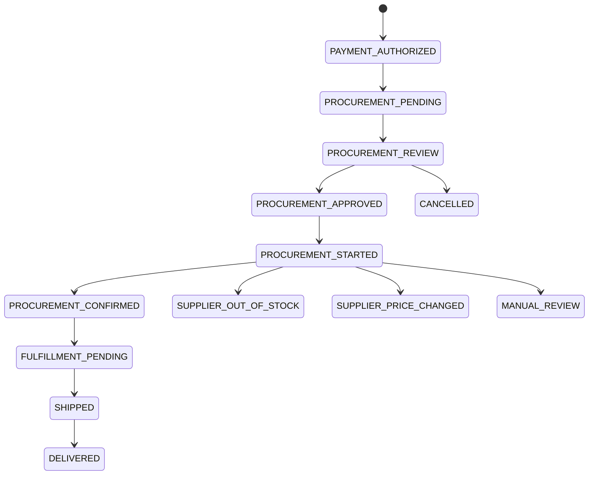

# Procurement

## Operating principle

Semi-automatic first. Human approval is a risk-control stage, not a temporary UI hack.

## Internal reservation

At/after payment authorization, acquire an internal Redis/Postgres lock for the order/listing to avoid duplicate Koli Parts procurement attempts. This does **not** reserve inventory on eBay or any supplier unless the supplier explicitly exposes a reservation API.

## Flow

## Pre-approval admin card

Show:
- customer/order,
- vehicle,
- fitment tier/evidence,
- supplier/listing URL,
- current supplier price vs quote,
- margin,
- shipping route/ETA,
- seller risk,
- payment authorization expiry,
- blockers/warnings.

The approval endpoint only moves an internal procurement from `PENDING` or `REVIEW` to `APPROVED`. It requires a valid Koli Parts session, CSRF token, `procurement_operator`/`admin`/`super_admin` role, and idempotency key. Approval records an audit log and does not start supplier ordering.

## Automation eligibility

Automation is allowed only when every configured condition passes, including provider permission, trusted seller, inventory/price revalidation, fitment threshold, margin floor, risk limit, shipping confirmation and kill-switch state.

## eBay rule

Default `EBAY_AUTOMATED_ORDERING=false`. Current official DE Buy checkout cannot be assumed to deliver to Bulgaria. Any German-hub flow requires explicit business/legal/eBay approval.
